# YALA (Yet Another LuCI App)

<div align="center">
  
  <h2>Modern OpenWrt & LuCI Router Manager</h2>

  [](https://github.com/nightcodex7/yala/releases)
  [](https://github.com/nightcodex7/yala/releases)
  [](https://github.com/nightcodex7/yala)
  [-3DDC84?style=for-the-badge&logo=android&logoColor=white)]()
  [](LICENSE)
  []()
  [](https://openwrt.org)

  <br>

  <a href="https://play.google.com/store/apps/details?id=com.nightcode.luci&referrer=utm_source%3Dgithub%26utm_medium%3Dreadme%26utm_campaign%3Dplay_badge">
    
  </a>
  &nbsp;&nbsp;
  <a href="https://github.com/nightcodex7/yala/releases/latest">
    
  </a>

  <p>
    <a href="https://github.com/nightcodex7/yala/releases/tag/v2.1.0-beta-ipa">
      <b>iOS Beta IPA Available on GitHub Releases</b>
    </a>
  </p>
  <!-- &nbsp;&nbsp;
  <a href="https://f-droid.org/packages/com.nightcode.luci/">
    
  </a> -->

  <br><br>

  <h3>Dashboard Preview (Light & Dark Theme)</h3>
  <p>
    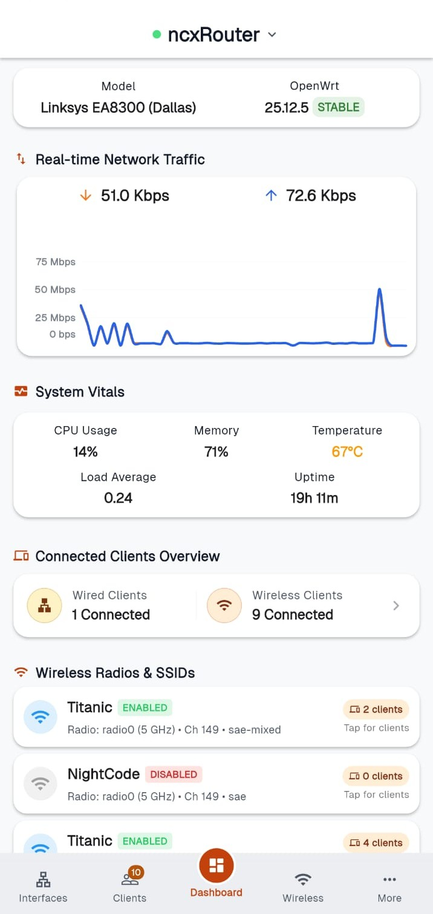
    &nbsp;&nbsp;&nbsp;&nbsp;
    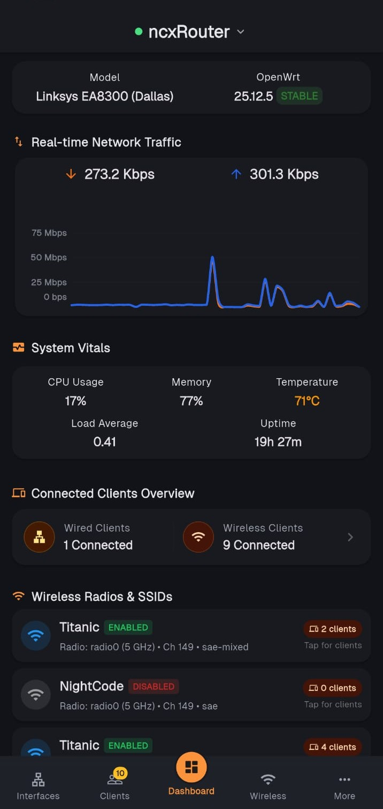
  </p>
</div>

<br>

**YALA (Yet Another LuCI App)** is an open-source mobile client for managing OpenWrt routers. It connects directly to your router using LuCI JSON-RPC, ubus, and standard OpenWrt system services, allowing you to monitor real-time bandwidth, manage connected devices, run network diagnostics, configure wireless radios, inspect storage, and update packages directly from your phone or tablet.

---

## Supported Devices & Scope

YALA is purpose-built for mobile, tablet, and touch-first form factors:

- **Smartphones:** Android (Android 8.0 Oreo up to Android 15/16) and Apple iPhone (iOS 14.0+).
- **Tablets & iPads:** Android Tablets and Apple iPads with dedicated wide-screen multi-column layouts and adaptive split views.
- **Foldables & Dual-Screen Devices:** Adaptive layouts with screen hinge and fold awareness (including Samsung Galaxy Fold/Flip series and Apple Duo / foldable layouts).
- **Chromebooks:** Supported through the ChromeOS Android runtime.
- **Android XR:** Spatial Android XR support.

> [!TIP]
> **iOS Beta Availability:**  
> An experimental iOS Beta `.ipa` build is available for sideloading on [GitHub Releases](https://github.com/nightcodex7/yala/releases/tag/v2.1.0-beta-ipa).

> [!NOTE]
> **Platform Scope:** YALA is tailored specifically for phone, tablet, and handheld interfaces. Desktop and laptop operating systems (native Windows, macOS, or desktop Linux) are outside the scope of this project, except for Chromebooks running Android apps.

---

## Key Features

### Multi-Router Management & Secure Vault

- **Multiple Router Profiles:** Save and switch between multiple OpenWrt routers with isolated credentials.
- **Hardware-Backed Vault:** Router IP addresses, credentials, and session tokens are encrypted locally using native secure storage (`flutter_secure_storage` with Android KeyStore and iOS Keychain).
- **Resilient Authentication Stack:** Automatic fallback chain supporting LuCI JSON-RPC (`/cgi-bin/luci/rpc/auth`), ubus JSON-RPC (`session.login`), and redirect-aware CGI form authentication (`sysauth` cookies and `stok` tokens).
- **HTTPS & Custom Ports:** Connect over HTTP or HTTPS with custom port configurations and optional self-signed SSL certificate acceptance for local home networks.

### Network Diagnostics Suite

- **Router-Side Ping:** Send ICMP ECHO_REQUEST packets directly from the router to any target IP or hostname with packet count selection, IPv6 toggle, and live min/avg/max latency calculation.
- **Visual Traceroute:** Trace network hops from the router with customizable hop limits and IPv6 support.
- **DNS Lookup / NSLookup:** Test domain name resolution against default upstream resolvers or custom DNS servers.
- **Routes, ARP & Conntrack:** Inspect kernel routing tables, active ARP neighbor caches, and live network connection tracking entries.
- **One-Tap Diagnostic Export:** Generate and copy clean, formatted diagnostic summaries for easy troubleshooting and sharing.

### Dashboard & Real-Time Vitals

- **Animated Gauges:** Live visual gauges for CPU load, RAM usage, Swap space, and flash root (`/`) filesystem capacity.
- **Real-Time Throughput Graph:** Smooth live chart displaying router network transfer rates (Rx/Tx) with customizable polling intervals.
- **Interface Status Cards:** Overview cards for WAN, LAN, and WWAN showing IP addresses, MACs, protocols, and WAN public IP verification.
- **Quick Actions:** Instant shortcuts to reboot the router, access network diagnostics, or inspect connected clients.

### Connected Clients & Lease Management

- **Unified Client List:** Merges active DHCP leases, ARP neighbor entries, and wireless stations into a single clear view.
- **Device Details:** Displays hostname, assigned IP, MAC address, vendor OUI lookup, connected SSID, and radio band badges.
- **IPv6 Management:** Cleanly displays deduplicated IPv6 address lists with expandable views for multiple private or link-local addresses.
- **Static DHCP Leases:** View, add, edit, and delete static IP reservations with immediate router synchronization.

### Wireless Networks & Guest Wi-Fi

- **Multi-Band Monitoring:** Monitor 2.4 GHz, 5 GHz, and 6 GHz radios with channel, frequency, transmit power, and channel width details.
- **Connected Stations:** Live station list per radio showing connected devices, signal strength (dBm), and bitrate metrics.
- **Wi-Fi Access Control:** Enforce MAC address allowlists or denylists with direct router UCI synchronization.
- **One-Click Guest Wi-Fi:** Provision guest Wi-Fi SSIDs with automatic AP client isolation (`ap_isolate=1`) and dedicated firewall zone isolation.
- **Wi-Fi QR Code Sharing:** Generate on-screen QR codes to help family and visitors connect without typing passwords.

### Dual Package Managers (OPKG & APK)

- **Smart Engine Detection:** Automatically detects and switches between `opkg` (OpenWrt 19.07–23.05) and modern `apk` (OpenWrt 24.10+ and 25.x snapshots).
- **Package Management:** Search repository feeds, update package lists, and install or remove packages directly.
- **LuCI App Companion Finder:** Discover, install, and manage installed vs available LuCI web extension modules (`luci-app-*`).

### Parental Controls & Timed Access

- **Device Profiling:** Group household devices under customizable profiles.
- **Automated Access Windows:** Enforce firewall blocking rules during scheduled restriction hours (such as study or bedtime) and restore access automatically.
- **Domain Filtering & Overrides:** Filter specific domains per profile or toggle instant unrestricted bypass overrides when needed.

### System Services, Cron & Dynamic DNS (DDNS)

- **Services Control:** View active `procd` daemons and `/etc/init.d/` startup scripts; start, stop, restart, enable, or disable services remotely.
- **Cron Scheduler:** View, add, edit, or delete scheduled crontab jobs (`/etc/crontabs/root`).
- **Dynamic DNS:** Monitor DDNS sync status, trigger forced IP updates, and view service status.
- **Optional SSH Service:** Connect via SSH for advanced router maintenance and SoC thermal sensor monitoring.

### Storage, Partitions & Backup/Restore

- **Storage Breakdown:** Inspect disk space usage across root `/`, `/overlay`, `/tmp`, and mounted external USB drives.
- **Pre-Restore Validation:** Validates gzip headers (`0x1F 0x8B`) and `tar` archive structures before uploading to prevent corrupt backup restores.
- **Preserved File Viewer:** Inspect files marked for retention during sysupgrade operations (`sysupgrade -l`).
- **MTD Partition Dumper:** Save binary `mtdblock` partition images directly from `/proc/mtd`.
- **System Maintenance:** Trigger remote system reboot or clean factory reset (`firstboot -y`).

### Safety Guardrails & Atomic Rollbacks

- **Self-Device Guard:** Automatically detects the managing phone's local IP and MAC address to prevent accidental self-lockouts during access rule changes.
- **Atomic UCI Rollback:** Automatically executes `uci revert` across target configuration files if an intermediate multi-step RPC request fails.

### Adaptive Design, Theming & Localization

- **Material 3 & Material You:** Dynamic wallpaper-extracted color palettes on supported Android devices, along with the signature YALA Amber theme.
- **Theme Modes:** Full Light and Dark mode support.
- **Localization:** Available in English, German, Spanish, French, Indonesian, Portuguese, Brazilian Portuguese, Russian, and Chinese.
- **Tablet & Foldable Optimization:** Responsive two-column and three-column layouts designed for tablets, foldables, and Chromebooks.

---

## Screenshots

<div align="center">
  <p><b>Explore full resolution screenshots of Yet Another LuCI App features:</b></p>
</div>

<table>
  <tr>
    <td width="25%" align="center" valign="top">
      <b>Login Screen</b><br/><br/>
      
    </td>
    <td width="25%" align="center" valign="top">
      <b>Dashboard (Light)</b><br/><br/>
      
    </td>
    <td width="25%" align="center" valign="top">
      <b>Dashboard (Dark)</b><br/><br/>
      
    </td>
    <td width="25%" align="center" valign="top">
      <b>System Vitals</b><br/><br/>
      
    </td>
  </tr>
  <tr>
    <td width="25%" align="center" valign="top">
      <b>Network Cards</b><br/><br/>
      
    </td>
    <td width="25%" align="center" valign="top">
      <b>Connected Clients</b><br/><br/>
      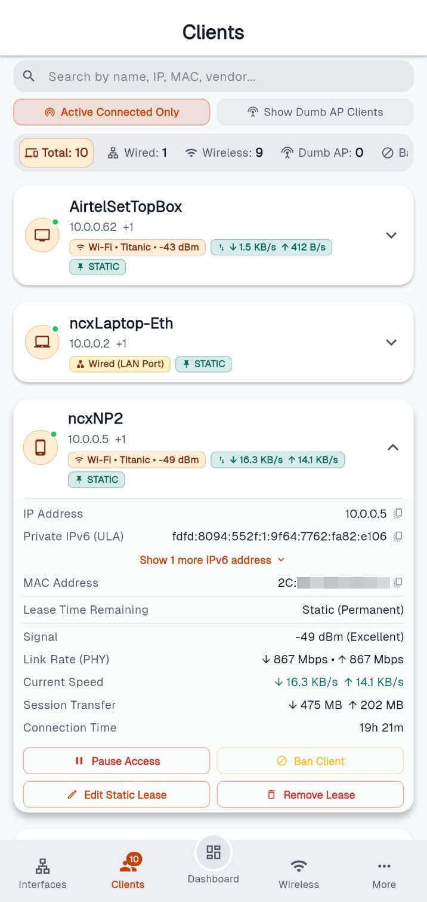
    </td>
    <td width="25%" align="center" valign="top">
      <b>Interfaces</b><br/><br/>
      
    </td>
    <td width="25%" align="center" valign="top">
      <b>Interface Details</b><br/><br/>
      
    </td>
  </tr>
  <tr>
    <td width="25%" align="center" valign="top">
      <b>Wireless Radios</b><br/><br/>
      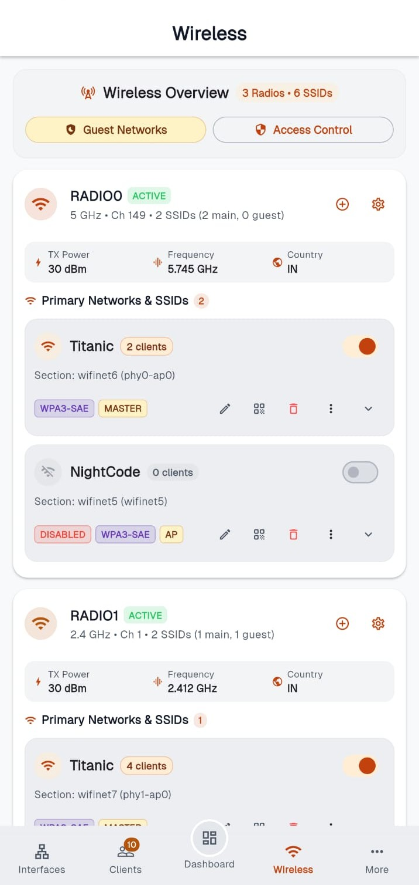
    </td>
    <td width="25%" align="center" valign="top">
      <b>System Info</b><br/><br/>
      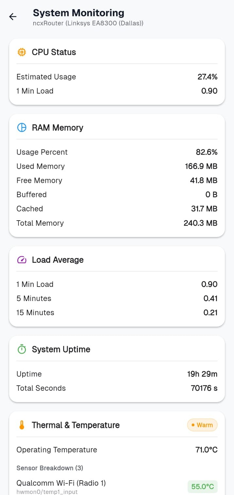
    </td>
    <td width="25%" align="center" valign="top">
      <b>Storage Monitor</b><br/><br/>
      
    </td>
    <td width="25%" align="center" valign="top">
      <b>Real-Time Charts</b><br/><br/>
      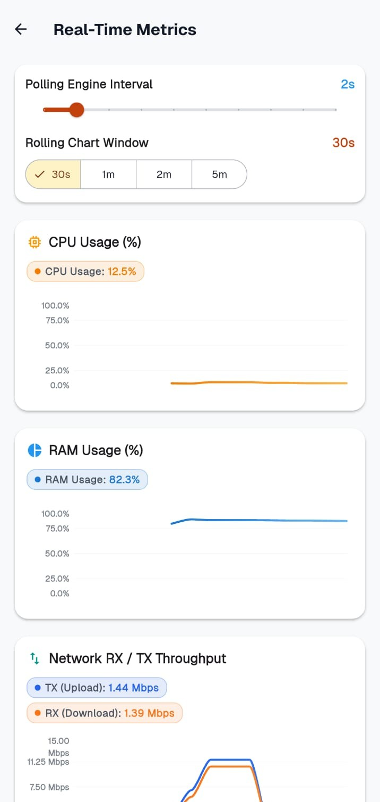
    </td>
  </tr>
  <tr>
    <td width="25%" align="center" valign="top">
      <b>DHCP & DNS</b><br/><br/>
      
    </td>
    <td width="25%" align="center" valign="top">
      <b>Firewall Rules</b><br/><br/>
      
    </td>
    <td width="25%" align="center" valign="top">
      <b>Port Forwarding</b><br/><br/>
      
    </td>
    <td width="25%" align="center" valign="top">
      <b>Services & System</b><br/><br/>
      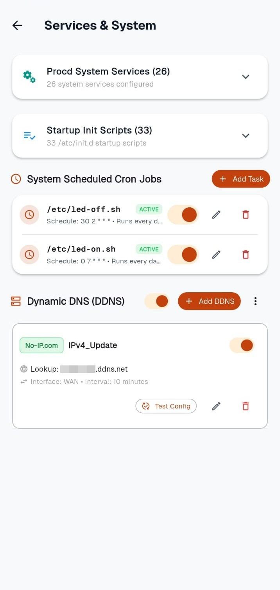
    </td>
  </tr>
  <tr>
    <td width="25%" align="center" valign="top">
      <b>Parental Controls</b><br/><br/>
      
    </td>
    <td width="25%" align="center" valign="top">
      <b>Parental Rules</b><br/><br/>
      
    </td>
    <td width="25%" align="center" valign="top">
      <b>Settings (PlayStore)</b><br/><br/>
      
    </td>
    <td width="25%" align="center" valign="top">
      <b>Settings (Community)</b><br/><br/>
      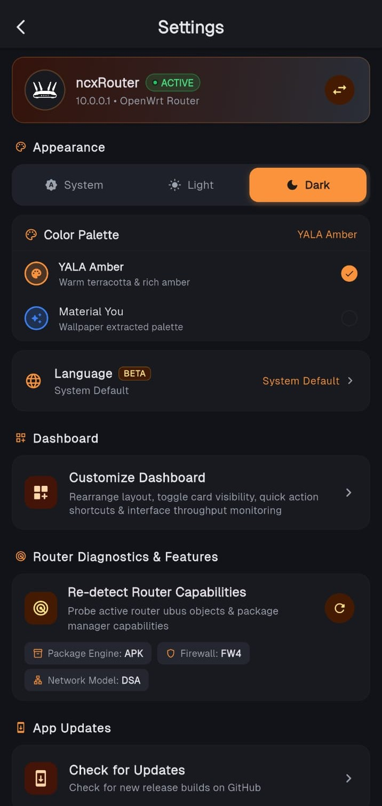
    </td>
  </tr>
  <tr>
    <td colspan="2" width="50%" align="center" valign="top">
      <b>Tools & More Menu</b><br/><br/>
      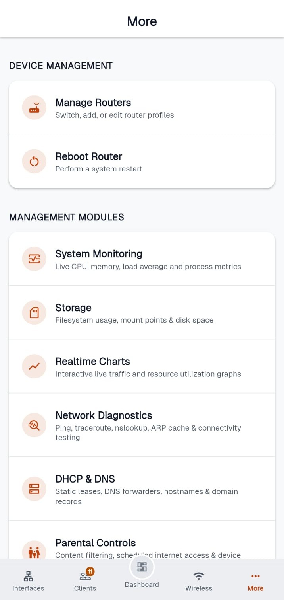
    </td>
    <td colspan="2" width="50%" align="center" valign="top">
      <b>Network Diagnostics</b><br/><br/>
      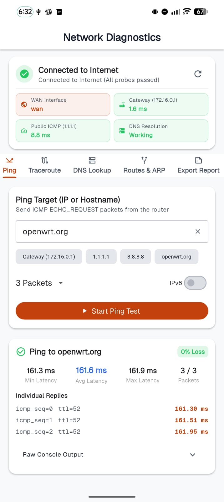
    </td>
  </tr>
  <tr>
    <td colspan="2" width="50%" align="center" valign="top">
      <b>Package Manager (Tablet)</b><br/><br/>
      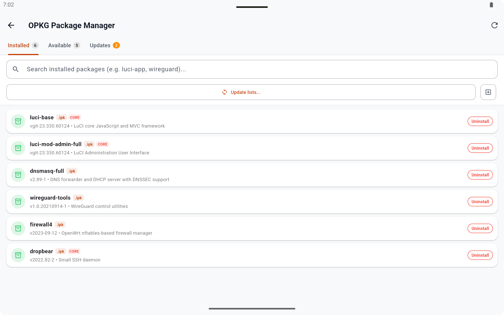
    </td>
    <td colspan="2" width="50%" align="center" valign="top">
      <b>About & App Info (Tablet)</b><br/><br/>
      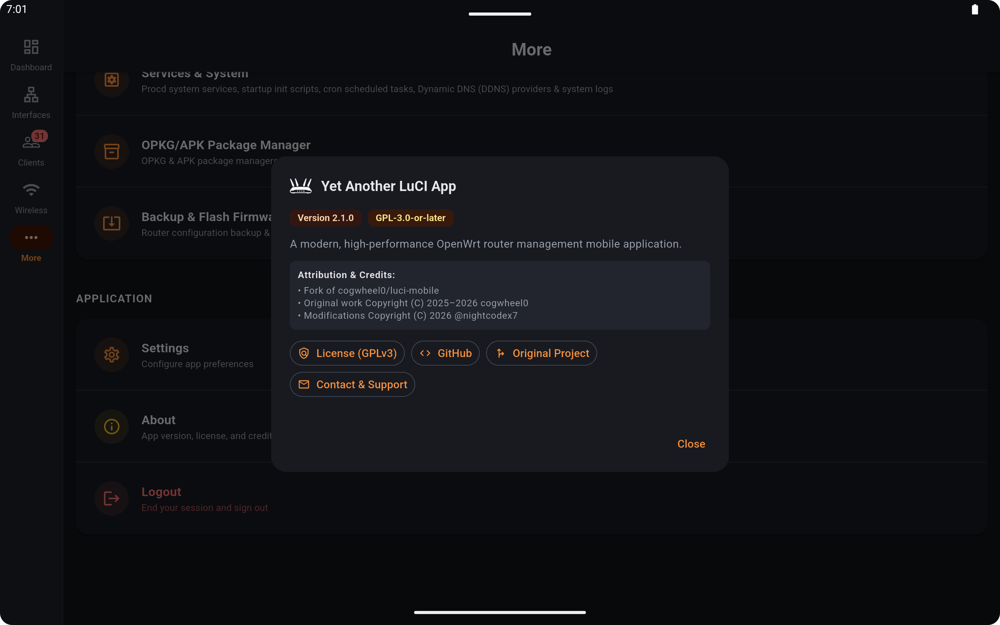
    </td>
  </tr>
</table>

<br>

<details>
  <summary><b>Show More Tablet & Large Screen Screenshots (8 Views)</b></summary>
  <br>
  <p>YALA automatically adapts its layout on tablets, iPads, foldables, and Chromebooks to take full advantage of wider screens:</p>
  <table>
    <tr>
      <td width="50%" align="center" valign="top">
        <b>Multi-Router Profiles & Quick Switch</b><br/><br/>
        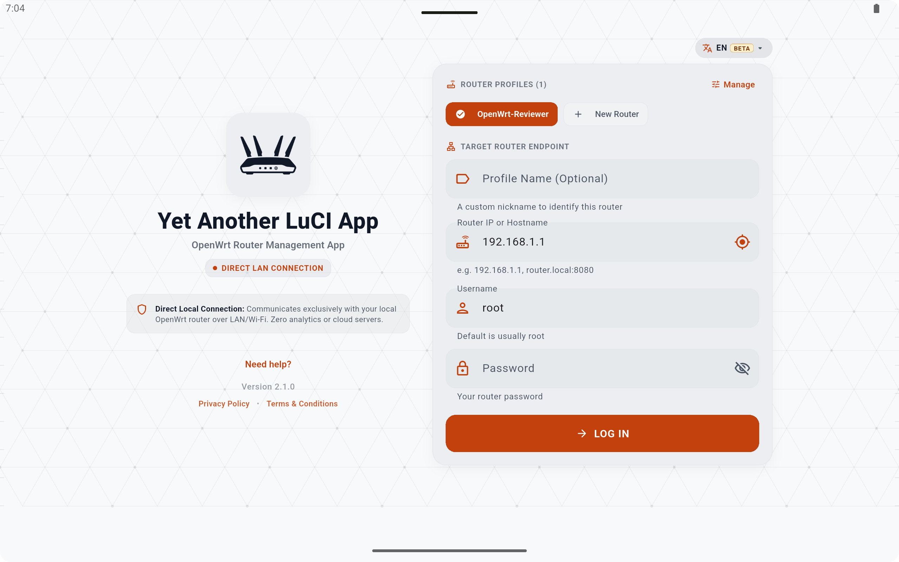
      </td>
      <td width="50%" align="center" valign="top">
        <b>Connected Clients & Device Details</b><br/><br/>
        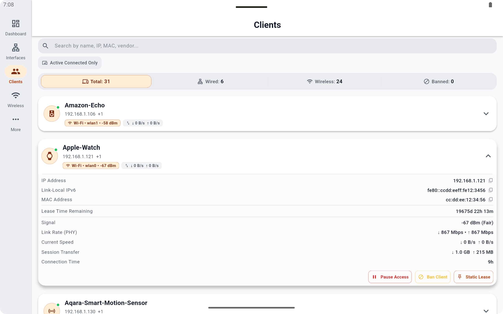
      </td>
    </tr>
    <tr>
      <td width="50%" align="center" valign="top">
        <b>Network Interfaces & DSA Switch Topology</b><br/><br/>
        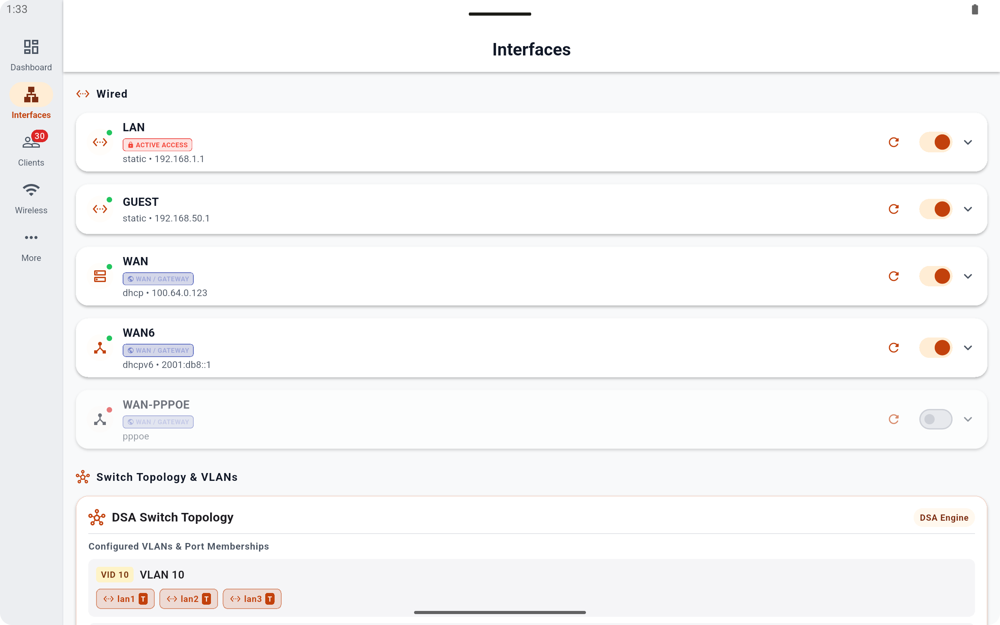
      </td>
      <td width="50%" align="center" valign="top">
        <b>Wireless Overview & Multi-Radio Management</b><br/><br/>
        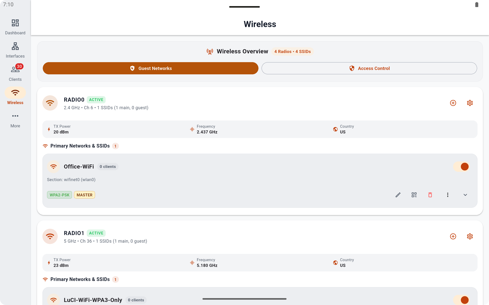
      </td>
    </tr>
    <tr>
      <td width="50%" align="center" valign="top">
        <b>Device Management & Modules Menu</b><br/><br/>
        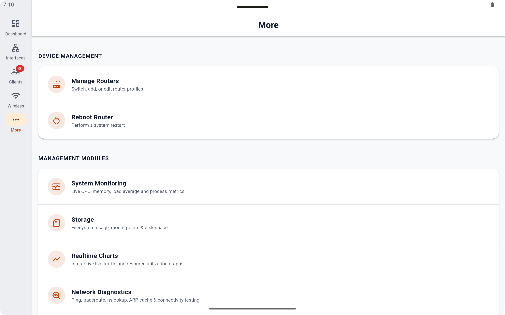
      </td>
      <td width="50%" align="center" valign="top">
        <b>DHCP & DNS Management</b><br/><br/>
        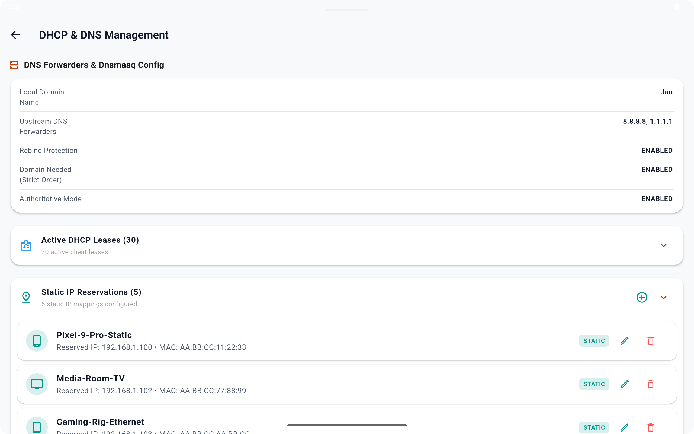
      </td>
    </tr>
    <tr>
      <td width="50%" align="center" valign="top">
        <b>Services, Init Scripts, Cron & Dynamic DNS</b><br/><br/>
        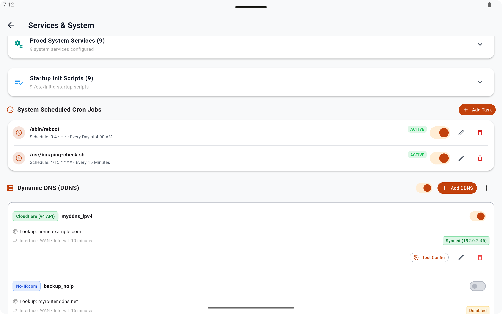
      </td>
      <td width="50%" align="center" valign="top">
        <b>App Settings & Customization</b><br/><br/>
        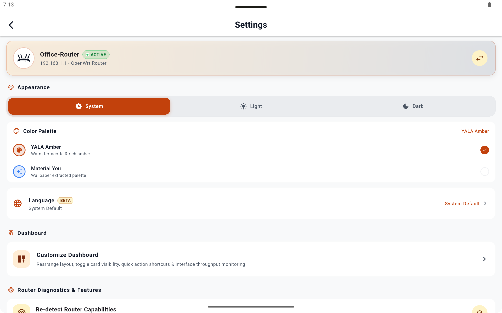
      </td>
    </tr>
  </table>
</details>

<br>

<div align="center">
  <p><i>Browse <a href="assets/screenshots/">assets/screenshots/</a> to view the full resolution collection of screenshots.</i></p>
</div>

---

## Repository Structure

```
yala/
├── .github/                   # CI/CD workflows (including unsigned iOS IPA build)
├── android/                   # Android native platform code & signing configs
├── assets/                    # Static app assets
│   ├── icons/                 # App launcher icons
│   ├── images/                # Brand graphics & logos
│   ├── mock/                  # Mock diagnostic data for review modes
│   └── screenshots/           # Full app screenshots (including Tab/ tablet gallery)
├── fastlane/                  # Google Play Store release metadata & changelogs
├── ios/                       # iOS/iPadOS platform runner & build configurations
├── lib/                       # Main Flutter codebase
│   ├── config/                # Design tokens, themes, app routes, and constants
│   ├── design/                # LuciTheme, breakpoints, responsive layouts & typography
│   ├── l10n/                  # Multi-language localization resources
│   ├── models/                # Data models (Client, Interface, Router, etc.)
│   ├── modules/               # Feature modules (Diagnostics, Package Manager, Parental Controls, etc.)
│   ├── screens/               # Core screens (Dashboard, Clients, Interfaces, Login, Settings, More)
│   ├── services/              # API communication layer, JSON-RPC client, SSH service, secure vault
│   ├── state/                 # State management engine (Riverpod controllers)
│   ├── utils/                 # Security guardrails, HTTP client managers, platform utilities
│   ├── widgets/               # Reusable UI widgets, animated gauges, throughput charts, topology map
│   └── main.dart              # Application entry point
├── store-badges/              # App store and release download badges
├── test/                      # Unit, widget, and integration test suite
├── pubspec.yaml               # Flutter package specification & dependencies
├── CHANGELOG.md               # Version history & sync logs
├── CONTRIBUTING.md            # Guidelines for open-source contributors
├── LICENSE                    # GNU General Public License v3.0 (GPLv3)
├── PRIVACY_POLICY.md          # Privacy policy disclosure
└── README.md                  # Project documentation
```

---

## Router Requirements & Setup

YALA connects directly to your OpenWrt router over HTTP or HTTPS. To ensure full compatibility with all dashboard and monitoring features, install the standard LuCI and RPC modules on your router.

### For OpenWrt 19.07 to 23.05 (OPKG)

SSH into your router and run:

```bash
opkg update
opkg install luci-mod-rpc rpcd-mod-luci rpcd-mod-iwinfo luci-mod-status
/etc/init.d/rpcd restart
```

### For OpenWrt 24.10, 25.x & Snapshots (APK)

OpenWrt 24.10 and newer versions use the `apk` package manager:

```bash
apk update
apk add rpcd-mod-luci rpcd-mod-iwinfo luci-mod-status
/etc/init.d/rpcd restart
```

> [!TIP]
> If your router already has standard LuCI web interface installed, most of these modules (`rpcd-mod-luci`, `luci-mod-status`) are usually already present. YALA automatically detects the available endpoints on your router.

---

## Security & Privacy Highlights

- **Zero Telemetry or Analytics:** No user tracking, no crash telemetry, and no third-party analytics SDKs are bundled into the application.
- **Local Credential Storage:** Router IP addresses, credentials, and session tokens are encrypted locally on your device inside hardware-backed storage (Android KeyStore / iOS Keychain).
- **Self-Device Protection:** Prevents you from accidentally blocking your own phone while configuring firewall rules or MAC filtering.
- **Atomic UCI Rollback:** If a multi-step configuration change fails midway, changes are automatically reverted (`uci revert`) to avoid breaking your router setup.
- **Secure Encrypted Connections:** Supports HTTPS endpoints and custom ports, with an optional self-signed certificate toggle for local subnets.

---

## Building & Running

### Prerequisites

- **Flutter SDK:** 3.27.0+ (or Flutter 3.32+)
- **Dart SDK:** 3.8.1+
- **JDK:** OpenJDK 17 or higher
- **Android Studio / Android SDK:** API level 35/36 (for Android builds)
- **Xcode:** 15.0+ (optional, for macOS/iOS builds)

### Quick Local Run

```bash
# 1. Clone repository
git clone https://github.com/nightcodex7/yala.git
cd yala

# 2. Install dependencies
flutter pub get

# 3. Analyze code quality
flutter analyze

# 4. Run test suite
flutter test

# 5. Run application on connected device
flutter run
```

### Building Release Packages

- **Android APK (split by ABI):**
  ```bash
  flutter build apk --split-per-abi
  ```
  *(Outputs architecture-specific APKs: `arm64-v8a`, `armeabi-v7a`, and `x86_64`)*

- **iOS Unsigned IPA (Local / CI):**
  ```bash
  flutter build ios --no-codesign --release
  ```
  *(Or trigger the manual GitHub Actions workflow `.github/workflows/build-ipa.yml` to produce an unsigned `.ipa` artifact for testing. Pre-built packages are also available on [GitHub Releases](https://github.com/nightcodex7/yala/releases/tag/v2.1.0-beta-ipa))*

---

## Contributing

Contributions, bug reports, and suggestions are welcome! Please read [CONTRIBUTING.md](CONTRIBUTING.md) before submitting pull requests.

1. Fork this repository on GitHub (`nightcodex7/yala`).
2. Create your feature branch (`git checkout -b feature/your-feature-name`).
3. Commit your changes (`git commit -m 'feat: description of change'`).
4. Push to the branch (`git push origin feature/your-feature-name`).
5. Open a Pull Request.

---

## Origin, Attribution & Licensing

> [!IMPORTANT]
> **YALA** is an independent, standalone project originally based on [`cogwheel0/luci-mobile`](https://github.com/cogwheel0/luci-mobile), created and authored by **cogwheel0**.
>
> Since diverging from the original codebase, YALA has been extensively refactored, modernized, and expanded by **@nightcodex7** with new capabilities including dual package managers (`apk` / `opkg`), a complete network diagnostics suite, tablet & foldable responsive layouts, hardware thermal monitoring, atomic rollbacks, and multi-language support.
>
> The complete codebase — including original upstream code and all subsequent modifications — is licensed under the [GNU General Public License v3.0 (GPL-3.0-or-later)](LICENSE).
>
> I express my sincere thanks to **cogwheel0** for creating the original foundation for mobile LuCI management.

> [!NOTE]
> **Licensing Historical Correction:**  
> Early releases of this project were inadvertently published with an Apache-2.0 identifier. That has since been completely corrected. The project is strictly licensed under GPL-3.0-or-later in accordance with the original project's copyleft terms.

### Copyright

- Original work Copyright (C) 2025–2026 cogwheel0.
- Modifications and enhancements Copyright (C) 2026 @nightcodex7.
